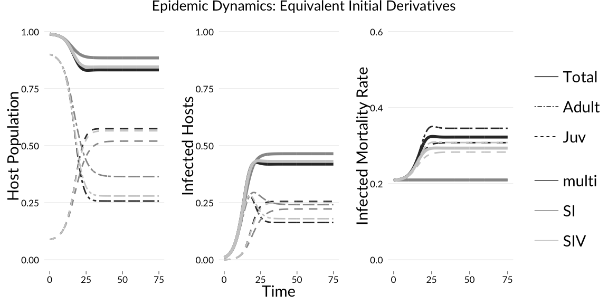

\numberwithin{figure}{section}
\pagenumbering{roman}
\setstretch{1}
\setlength{\parskip}{9pt}

\begin{center}

\textbf{Disease with Multiple Infections: Population Structure, Dynamics, and Control}  

By

NOAM ROSS

Bachelor of Science (Brown University) 2006

DISSERTATION

Submitted in partial satisfaction of the requirements for the degree of

DOCTOR OF PHILOSOPHY

in

Ecology

in the

OFFICE OF GRADUATE STUDIES

of the

UNIVERSITY OF CALIFORNIA

DAVIS

\vspace{36 pt}

Approved:

\setlength{\parskip}{20pt}

\underline{\hspace{8cm}}\\
Alan Hastings, Chair

\underline{\hspace{8cm}}\\
David Rizzo

\underline{\hspace{8cm}}\\
James Sanchirico

\vspace{36 pt}

Committee in charge

2015

\end{center}
\setlength{\parskip}{5pt}

\newpage

\hypersetup{linkcolor=black}
\tableofcontents
\setlength{\parindent}{1cm}

\newpage
\setstretch{2}
\setlength{\parskip}{6pt}

## Abstract

Emerging fungal pathogens pose threats to plant, animal, ecosystem and human health [@Fisher2012]. Some of these pathogens, which include true fungi and fungus-like eukaryotes, share traits traits such as host generalism, reservoir hosts or environments, and high mortality rates in select hosts. One common set of traits amongst several emerging fungal diseases is load-dependent mortality in hosts, and the ability of fungal spores to colonize hosts repeatedly to increase loads [@Briggs2010; @Langwig2015].  This set of properties suggests that these diseases are best modeled using a macroparasite [@Anderson1978], or multi-infection, framework, which explicitly tracks disease burden within and across host organisms.

Macroparasites are generally thought of as persistent infections of populations, rather than transient epidemic phenomena [@Gulland1995]. Less attention has been paid to their transient dynamics, and the macroparasite framework is rarely used in cases of emerging epidemics.  It is also little used in plant pathology.  However, as some emerging fungal diseases can strongly suppress populations and even cause local extinctions [@Fisher2012; @Langwig2015], these dynamics are important in their study and management. In this dissertation, I explore several problems associated with using using the macroparasite framework to model the dynamics of emerging fungal disease and manage its outcomes.

In the early phases managing an emergent disease, a key problem is identifying an appropriate model to use in forecasting long-term behavior. In Chapter 1, I analyze differences in the dynamics of $SI$ and macroparasite disease processes, with the purpose of identifying signatures of macroparasite processes that can be identified from disease dynamics, and comparing the expected long-term behaviors of each. In general, macroparasite diseases generate larger epidemics and greater host mortality than $SI$ models with similar behavior at the early stages of disease.  Macroparasite diseases also generate age-mortality patterns, even in the absence of age structure in host vulnerability, which may be useful in identifying this type of disease.

Macroparasite models are inherently high-dimensional because of the need track variation in disease load amongst individuals. Thus, they are excellent candidates for individual-based modeling [@Grimm2005, IBM].  However, this high-dimensionality poses a challenge to optimal control techniques, which are useful in planning management responses to epidemics. In Chapter 2, I introduce a new numerical method for optimal control using individual-based models, which uses a form of numerical model-reduction known as "equation-free modeling" [Kevrekidis2009a, EF].  EF allows approximation of expected derivatives of stochastic IBMs, which in turn can be used to solve a Hamiltonian optimal control problem.  I show that the EF method can produce the equivalent results to an analytical approach, without the need for closed-form equations of disease dynamics.

Aggregation is a core concept in macroparasite epidemiology.  Parasites are commonly aggregated in nature, and the negative binomial distribution is commonly used to model these aggregated, or overdispersed, distributions. This overdispersion is a feature of stable macroparasite populations. In chapter 3, I explore the evolution of dispersion, showing how underdispersion can occur in transients of macroparasite models, even in the absence of density dependence, due to time-delay effects. I examine the utility of using the Conway-Maxwell-Poisson distribution [@Conway1962, CMP] to model these transient populations, and find it provides a better approximation to  distributions in the @Anderson1978 model than the negative binomial, whether parasites are under- or overdispersed.  I also introduce an r package, **cmp**, for fitting the CMP distribution to data.

\newpage

## Acknowledgements

I have been fortunate to have many brilliant, patient, and collegial mentors on the way to my Ph.D. My advisor, Alan Hastings, gave me freedom to explore (and discard!) many topics on my circuitous route to this dissertation, and guidance and wisdom in narrowing my scope when it came time to settle on a topic. His vast knowledge, critical eye, and professional support have been essential in beginning a career as an ecologist.

I have greatly appreciated Jim Sanchirico's feedback, on this dissertation and many other projects. Jim's penchant for cutting to the heart of an issue and finding key weaknesses to address has been essential in improving my work, and is a skill I hope to emulate.

Dave Rizzo's mentorship has helped keep my theoretical work grounded in biology and in the real constraints of management problems related to forest disease.  I also thank him for inviting me in to be part of his lab, where I found a whole new community of friends and colleagues. 

My collaboration with Richard Cobb has been a fount of ideas.  The core concepts that motivate this thesis emerged from his empirical work on Sudden Oak Death and our many fruitful discussions about reconciling what he found in the field with the predictions of our models. Jaime Ashander has also served as as a key sounding board for my ideas at every stage.

No one has had more influence on my approach to science as my lab mate Carl Boettiger, now at UC Berkeley. Carl introduced me to the concepts and community of open science, and was a constant source of useful advice and debate. He answered countless programming and mathematical questions of mine over the course of five years.

Sebastian Schreiber and Marissa Baskett have also been wonderful sources of advice and feedback, and their stewardship of the "Teary Group", the weekly meetings of the ecological theory-oriented labs at Davis, provided my core intellectual community.

Graduate school has the reputation of being an lonely slog. The warm, collegial community of the UC Davis Graduate Group in Ecology proves it doesn't need to be so. In addition to being a powerhouse of interdisciplinary intellectual activity, the GGE has been a source solidarity and camaraderie. Amongst my fellow students I found inspiration, support, and many lifelong friends. I am grateful to Sharon Lawler, who led the GGE in my time at Davis, for nurturing both the academic and social strength of the group.

Finally, none of this work would have been possible without the support, wisdom, love, and example of my parents, brother and sister: William, Nechama, Jonathan, and Karen Ross.  They have been my greatest mentors as a scientist and as a human being.

\newpage

\newpage

\pagenumbering{arabic}
\setcounter{page}{1}

\setstretch{1}

# Fungal disease and stage structure: modeling short and long-term dynamics

\setstretch{2}

Noam Ross

Introduction
------------

Emerging fungal infections pose major threats to plant and animal wildlife
populations as well as livestock and crops. Fungal life-history traits, including high
virulence, long-lived environmental reservoirs, and host generalism are thought
to contribute to the potential of these pathogens to drive local and global
extinctions of some species [@Fisher2012; @Eskew2013].

An important component of fungal host-pathogen dynamics is the role of spore load
(or innoculum load) in driving host infectiousness and mortality. @Briggs2010 showed that
population-level persistence or extinction of mountain yellow-legged frogs (*Rana
sierrae*) infected by chytrid fungus (*Batrachochytrium dendrobatidis*), could
be explained by the dynamics of spore load build-up in these populations.
Similarly, mortality of bat populations
with white nose syndrome (*Geomyces destructans*) is closely related to spore
load on bat skin, which builds up through bat-to-bat contact over the course of
the hibernation period [@Langwig2015]. The fungal parasite *Metschnikowia
bicuspidata* kills its *Daphnia* host when the parasite loads are high enough to
interfere with cell metabolism [@Hall2009b]. Sudden Oak Death, caused by the oomycete *Phyophthora ramorum*,
kills tanoak (*Notholithocarpus densiflorus*) faster in the presence of large
numbers of other infected hosts, indicating that continued accumulation of
infections, rather than just disease progress, drives mortality [@Cobb2012]. Many mammals, including humans,
which are generally resistant to fungal diseases or asymptomatic under normal
conditions may nonetheless become infected and exhibit symptoms or mortality
under persistent exposure to large fungal spore loads [@Casadevall2005].

Many attempts to model fungal disease dynamics have used traditional susceptible-infected ($SI$) disease frameworks, which represent
disease as a binary state of the host [@Kermack1927; @Briggs2005; @Mitchell2008; @Meentemeyer2011; @Foley2011a; @Maher2012;  @Cobb2012; @ORegan2014]
Extensions such as
susceptible-exposed-infected-removed ($SEIR$) models represent disease
progression within hosts, but do not capture the accumulation of new 
infections in hosts that may drive disease impacts. For fungal diseases where
infection centers establish independently via the arrival of spores, reproduce
independently, and have cumulative affects on host fitness, this dynamic may be
described by macroparasite models [@Anderson1978].  In these models 
disease is represented by the number of discrete infections (or parasites)
within each host. Here I use the term multi-infection to describe these models to
encompass infections such as microbial fungi.

Response to disease outbreak often requires prediction of medium- and long-term
behavior from early-phase dynamics of disease, which in turn requires
mechanistic disease models. However, in early stages of epidemics of emerging
diseases, the importance of spore load may not be known, nor the
appropriateness of multi-infection rather than $SI$ models. Spore load is
often considerably more difficult to measure than prevalence, allowing only
observations of susceptible vs. infected states. However, model choice may have
considerable influence on predictions of disease dynamics and management
response.

Age and stage structure is another potentially important factor driving fungal
disease dynamics. The effect of Chytrid fungus on frogs varies across
life stages [@Rachowicz2004; @Garner2009]. Mortality rates in tanoak are much
greater in large trees than small ones [@Cobb2012]. However as organisms can
grow over similar time scales as the progress of a fungal epidemic, observed
patterns in age-disease relationships can be difficult to disentangle from
host-pathogen dynamics.

There is a considerable literature on host-pathogen dynamics in age- and
stage-structured populations using $SI$ models [@CastilloChavez1989; @Busenberg1990; @Diekmann1990; @Hethcote2000;
@Dietz2002; @Klepac2010]. There is a somewhat
smaller literature on age structure in multi-infection models. In
multi-infection models, @Krasnov2006 showed that parasite counts increase with
age in rodents. @Pacala1988 created a method to detect the mortality effect of
macroparasites based of the distribution of parasites among different age
groups. @Duerr2003 showed how age-infection relationships could be modified by
a variety of age, time, and density-dependent processes, but also showed that
interpretation of such age-infection patterns was ambiguous if more than one
such process was operating.

Here I explore how the transient host-pathogen dynamics differ between $SI$ and
multi-infection systems. To compare models with different structures and in
which parameters have different interpretations, I fit the models to each other
so that they have identical dynamic behaviors at different stages of an epidemic.
Using this approach, I ask, how do $SI$ and multi-infection models that behave
similarly at early stages of disease differ in long-term dynamics, and vice versa? 
I also ask, how does model structure affect predictions of stage-specific behavior?
I find that mortality rates increase over time in multi-infection models, diverging
from $SI$ models, and that these mortality rates diverge between host stages
due to accumulation of infections, even when stage-specific parameters are identical.
An intermediate model form with multiple infections lower dimensionality, $SIV$,
qualitatively captures most of the important features of the multi-infection forms.

Methods
-------

### Model Structure

I compared dynamics in 3 ODE disease models: A simple $SI$ model, a
multi-infection model based on @Anderson1978, and an intermediate $SIV$
(susceptible-infected-*very* infected) model.

Each model has a two-stage population structure (population $N$ = juveniles
$J$ + adults $A$). New individuals enter the uninfected, juvenile stage via
density-dependent recruitment ($fN(1-N/K)$, where $f$ is fecundity and $K$
carrying capacity). Individuals move from juvenile to adult classes at the
transition rate $g$.

Disease transmission is density-dependent; in the $SI$ model, susceptible individuals $(J_S, A_S)$
become infected $(J_I, A_I)$ at a rate equal to the density of infected
individuals times the transmissivity of the disease $(\lambda)$. All individuals
die at the a base rate $(d)$, and diseased individuals have additional mortality
$(\alpha)$.

The complete $SI$ model is defined by the equations

$$\begin{aligned}
  \frac{dJ_S}{dt} &= fN(1 - N/K) -
                     J_S(d + g + \lambda J_I + \lambda A_I)
  &\frac{dA_S}{dt} &= g J_S - A_S(d + \lambda N) \\
  \frac{dJ_I}{dt} &= \lambda J_S (J_I + A_I) - J_I(d + g + \alpha)
  &\frac{dA_I}{dt} &= g J_I + \lambda A_S (J_I + A_I) -
                      A_I(d + \alpha) \\
  N &= J_S + A_S + J_I + A_I
\end{aligned}$$

Note that in this model the effect of age structure is trivial: neither demographic nor
epidemiological parameters vary with age. When juvenile and adult classes are
summed, the growth term $g$ drops out, and $dN/dt$ is independent of $g$. Thus,
it is a "null model" for age effects.

The other two models are extensions of the $SI$ model with additional disease
classes representing degrees of infection. In the multi-infection model, there
are an infinite number of disease classes designated
$i = 0, 1, 2, \dots, \infty$. For purposes of simulation, the number of classes
is truncated, with a maximum value of $k$. Transmissivity $(\lambda)$ and
mortality $(\alpha)$ are additive in these models, increasing linearly with
$i$. Individuals advance to the next disease class at rate $\Lambda$, the overall
force of infection, which is the sum of each tree's contribution, $i\lambda$.
Individuals in each stage die at rate $d + i\alpha$. Here is the complete
multi-infection model:

$$\begin{aligned}
  \frac{dJ_0}{dt} &= fN(1 - N/K) - J_0(d + g + \Lambda)
  &\frac{dA_0}{dt} &= g J_0 - A_0(d + \Lambda) \\
  \frac{dJ_i}{dt} &= \Lambda dJ_{i-1} -
                     J_i(d + g + i\alpha + \Lambda)
  &\frac{dA_i}{dt} &= g J_i + \Lambda A_{i-1} -
                     A_i(d + i\alpha + \Lambda) \\
  \frac{dJ_k}{dt} &= \Lambda dJ_{k-1} - J_k(d + g + k\alpha)
  &\frac{dA_k}{dt} &= g J_k + \Lambda A_{k-1} - A_k(d + k\alpha) \\
  N &= \sum_{i=0}^k J_0 + A_0
  &\Lambda &= \lambda \sum_{i=1}^k i(J_i + A_i)
\end{aligned}$$

The $SIV$ model is merely a truncated version of the multi-infection model, with
$k = 2$. For this model I refer $N_0$ as $S$, $N_1$ as $I$ and $N_2$ as $V$, and
use $S$, $I$, and $V$, as subscripts for $J$, and $A$ as well. I also use the term
"infected" to refer to individuals of either the $I$ class in the $SI$ model, or
having at least one infection in the $SIV$ or multi-infection models.

Multi-infection models typically assume a distribution of infections in order to
reduce the infinite system of equations [@Anderson1978]. Negative-binomial distributions
of infections allow tractable analysis of such models and match empirical
studies of infection distribution in the wild [@Wilson2002]. However, reduced models
only approximate the full model asymptotically, and do not capture the transient
dynamics of changing distributions[@Adler1992]. Also, while the distribution
of parasites for the whole population may be approximated in this way, the
distributions within stages can not, as the process generating these distributiosn
does not capture the transfer of infected individuals
from one stage to another (See Appendix A.1 for more details).
Instead, I avoided making such assumptions by simulating the full system of
equations, truncating at $k=10$. For the parameters below, higher values of $k$
yielded no difference in dynamics.

### Comparative parameterization

I compared the models' behaviors under parameterizations determined "equivalent" by one of three of heuristic criteria described below. As the
models have different structures, parameters in the models have different
interpretations. Specifically, $\lambda$ and $\alpha$ operate on a
per-individual basis in the $SI$ model, while they operate on a per-infection
basis on the $SIV$ and multi-infection models. 

In order to determine equivalent parameterizations between models, I set
parameters for the $SI$ model to those in Table 1. I then fit the $SIV$ and
multi-infection models so that they would exhibit identical *behavior* to the
$SI$ model under different criteria. The behavior of SIV and multi-infection
models were adjusted by multiplying each of infectivity and disease-induced mortality
$(\lambda, \alpha)$ parameters by a constant, $c$.

Initial conditions in simulations were set at the disease-free equilibrium of
the system, modified with 1% of both juveniles and adults having a single
infection.

  Parameter                                          Symbol      Base Case Value
  ------------------------------------------------ ----------- -----------------
  fecundity                                            $f$                     1
  carrying capacity                                    $K$                     1
  transition rate                                      $g$                   0.1
  mortality                                            $d$                  0.01
  disease-induced mortality                         $\alpha$                 0.2
  transmissivity                                    $\lambda$                  0.5
  max number of infections (SIV/multi-infection)       $k$               2 / 10

Table 1: Base parameters for disease models

I examined model behavior in three cases. In each case using a different criterion to define equivalent parameterization:

1.  **Equilibrium mortality rate**. The first behavioral criterion was identical
    equilibrium mortality rate across models. $c$ was varied to match the
    overall disease-induced mortality rate (and thus the total mortality rate)
    between models. That is, at steady state,

    $$\alpha_{SI} = \alpha_{SIV} \frac{I + 2V}{I+V} 
              = \alpha_\text{multi} \frac{1}{N} \sum_i i N_i$$

2.  **Initial growth and acceleration rates of infected individuals.** Next, $c$
    was adjusted such that the second derivatives of growth of total
    infected individuals under initial conditions. (The first derivative is
    identical in all cases.) That is,

    $$\frac{d^2 I}{dt^2} = \frac{d^2(I+V)}{dt^2} = \frac{d^2 N_{i > 0}}{dt^2}$$
    at initial conditions of $S \approx N$,
    $I_{SI} = I_{SIV} = N_{1\, multi} \approx 0$ and
    $I_{SIV} = N_{i \geq 2\, multi} = 0$.

3.  **Time to 10% infection**. This criterion was selected to match behavior
    among models during the early transient period of disease. $c$ was adjusted
    so that the $SIV$ and multi-infection models would reach 10% infection in
    the same time period as the $SI$ model. That is,

    $$t\big|_{\frac{I}{S+I} = 0.1} = t\big|_{\frac{I+V}{S+I+V} = 0.1}
                            = t\big|_{\frac{N_{i \geq 1}}{N} = 0.1}$$

All simulations were performed in R [@RCORE], using the deSolve
package [@deSolve] for simulation, the numDeriv package to determine derivatives
[@numDeriv], and the ggplot2 [@ggplot2] package for plotting. Code to reproduce these
results can be accessed online at `https://github.com/noamross/comp-disease-dynamics`.

Results
-------

### Parameterizations

For the equilibrium parameterization, the constant $c$, or the ratio of $\alpha$ and $\lambda$ values between
the models, is the inverse of the mean number of infections at equilibrium
in the $SIV$ and multi-infection models. This is 0.69 for
the SIV model and 0.61 for the multi-infection model. For the
acceleration-rate parameterization, $c$ is 0.99 for both $SIV$ and multi-infection
models.  For the time-to-10% infection parameterization, $c$ was is 0.98 for both models.
Results for both initial acceleration and time-to-10% infection parameterizations were
nearly identical (See Appendix A.2), so I report only the equilibrium and time-to-10% results in
the sections below.

### Dynamics of mortality rates

**Models with similar mortality rates at invasion or equilibrium diverge at 
other times.**  Mortality rates of infected individuals in both the $SIV$ and 
multi-infection models evolve over time while they are constant the $SI$ model.
(Figure 1). In all cases, $SIV$ and multi-infection mortality rates increase over
time until equilibrium.  The increase in mortality is greater in the multi-infection
model than the $SIV$ model, though the pattern is qualitatively similar. 

 

This change in mortality rates is driven by changes in the distribution of
infections over time (Figure 2). Early in the epidemic, individuals have small
numbers of infections, thus the mortality rate across the whole infected population
is low. As the epidemic progresses, the mean number of infections
per infected individual increases, raising the mortality rate of the infected
class until equilibrium is reached. As the disease progresses
through the population in the $SIV$ model, the proportion of individuals in the
$I$ and $V$ classes increases for both juveniles and adults. Similarly, in the
multi-infection model, the mean number of infections in each individual
increases over time, increasing the mortality rate.

![Dynamics of infection classes in $SIV$ and multi-infection models. Top: Dynamics in the $SIV$ model, with juvenile (dark grey) and adult (light grey) populations in each infection class at eight time points.  Bottom: Dynamics in the multi-infection model, showing distributions of infection numbers in both adults and juveniles at each time point.  In both cases, as the epidemic progresses, a greater proportion of the population advances to higher disease classes, and with greater mean disease counts in adults than juveniles.](figures/Ch1/Fig2-1.png) 

**Multi-infection models generate observed stage-dependent mortality patterns even
in the absence of biological difference among stage classes.**

In the $SIV$ and multi-infection models, the mortality rates of infected
juveniles and adults diverge, with adults having greater mortality rates than juveniles at
equilibrium (Figure 3). This occurs in all parameterizations, but not in the $SI$ model.
Like the overall mortality rate, the difference in mortality rates between juveniles
and adults is greater in the multi-infection model than the $SIV$ model.  It is
also greater in the equivalent time-to-10% infection parameterization than in the equivalent
equilibrium parameterization.

The reason for this can be
found in Figure 2, which shows the distribution of infections for both
adult and juvenile populations over the course of the epidemic in $SIV$ and
multi-infection models. At the beginning of the epidemic, both infected adults
and infected juveniles have the same mean number of infections. As the epidemic continues, adults accumulate more
infections than juveniles by both new infections on adult trees and
already-infected juveniles recruiting into the adult population.  

As a result,
older individuals have more infections, and thus greater mortality and
infectivity, than younger individuals.  Even in the
absence of age-driven variation in how individuals respond to disease (that is,
in these "null models"), different behavior is observed between state. In an
$SI$ model, these differences do not arise.

 

All three models, under all three parameterizations, exhibit some common
patterns in the dynamics of population stages. From the disease-free equilibrium
dominated by adults, disease outbreak decreases the population of adult stages
and increases both the relative and absolute population of the juvenile
stages (Figure 2). 

**Epidemic speed and effects on host populations**

Differences in mortality rates across models result in differences in overall
effects on host populations. In all cases, the epidemic results in an equilibrium
condition where the host population is suppressed relative to the disease-free
equilibrium.  However, in the equivalent equilibrium parameterization of the
$SIV$ and multi-infection models, the time to reach this condition is greater,
with the multi-infection case being slowest to reach equilibrium (Figure 4).

Under the equivalent time-to-10% infection parameterizations, the time to equilibrium
for the models is similar.  However, $SIV$ and multi-infection epidemics suppress host
populations more than in the $SI$ model, with the multi-infection model suppressing
the host population more.

![Dynamics of host populations during disease invasion.  Left: Host populations over the course of an epidemic for $SI$ (solid), $SIV$ (dashed), and multi-infection (dotted) models when all are parameterized to equal mortality rates at equilibrium.  Right: Host populations when each are parameterized to equal time-to-10%-infection. In the former case, multi-infection models take longer to reach equilibrium than $SI$. In the latter, their effect on host populations is greater than in the $SI$ models. $SIV$ have similar but smaller differences than $SI$ models.](figures/Ch1/Fig4-1.png) 

<!-- ADD figs for:
1.  Models with equivalent equilibrium behavior will have very different
    invasion criteria. Multi-infection will be *less* likely to become
    epidemic from a single infection

2.  These effects increase as the transition rate from juvenile to adult age
    classes increase. this changes the relative amount of time individuals in
    each class have had to acquire infections.  -->

Discussion
----------

$SI$ and multi-infection models represent fundamentally different types of disease
dynamics.  In  $SI$ models, disease is represented 
as a binary state of an individual, while multi-infection models disease accumulations as multiple infections within
individuals. Comparison of the dynamics of these model types shows they produce 
different host-pathogen dynamics. The choice of model structure has important 
consequences for the prediction of host-pathogen disease dynamics.

Epidemics that appear to be well represented by $SI$ models during their
outbreak phase may no longer be well represented in later stages if they have
dynamics driven by multiple infections. A multi-infection model that behaves
like an $SI$ model in early stages will diverge from $SI$ behavior as increasing
spore loads result in greater per-individual mortality rates. I found
similar behavior regardless of the criterion used to determine early-phase
dynamics (derivatives or time-to-10%-infection). If the multi-infection system
system has an equilibrium (other than disease-free or extinction), the host
population will be lower at this equilibrium than in an $SI$ system due to
greater suppression from to disease.

Conversely, if an $SI$ model is used to represent a multi-infection disease and
is based on equilibrium behavior, it can incorrectly predict outbreak behavior.
Multiple-infection models with the same equilibrium behavior as $SI$
models are slower to emerge, as the small numbers of infections on initially
infected individuals transmit less disease and kill at slower rates than "fully"
infected individuals in the $SI$ model, which have higher per-individual
transmission mortality. The models converge when mean infection numbers in
individuals in the multi-infection model rise such that their virulence matches
individuals in the $SI$ model.

Multiple-infection models indicate that age- or stage-related patterns in
disease mortality can arise from the accumulation of infections over time, even
in the absence of biological differences among age class in susceptibility to
disease. Here I found that, in all parameterizations of multi-infection models,
adult mortality rates increased faster than juvenile mortality rates as
epidemics progressed, even though per-infection mortality rates were identical
between life stages. While in some fungal diseases, host-pathogen interactions
drive differences in virulence between life stages (e.g., chytrid fungus, see
@Rachowicz2004), this difference could explain part or all of stage-related
differences in mortality in other fungal diseases, such as in Sudden Oak Death
[@Cobb2012].

Multiple infection-models also showed increased population-level age effects of
disease. In simulations where both $SI$ and multi-infection models had similar
initial behavior, disease resulted in a shift from adult- to juvenile dominance
over the course of the epidemic, but in the multiple-infection model this shift
was greater, as adult mortality was greater. Also, adult disease prevalence was
lower in the late stages of multiple infection models, because with higher adult
mortality diseased adults have short lifespans.

Overall, multi-infection models have greater affects on the population, in
terms of mortality rates, population suppression, and age structure modification,
than $SI$ models that appear similar in the early stages of an epidemic. 
In the parameterizations here, these affects were approximately 50% greater. Using an
$SI$ model to predict long-term effects of such a disease could lead to an underestimation
of impacts, and result in inadequate management responses. 

Simplified models of multiple infection, such as the $SIV$ model presented here,
can capture some of the components of load-driven disease dynamics. Here, the
$SIV$ model behaved similarly to the multi-infection model, including similar
qualitative differences in time-to-equilibrium from the $SI$ model,  suppression of
the final population, and age-mortality
patterns. However, there were differences between the $SIV$ and multi-infection
model in the apparent mortality rate of infected hosts, which indicate a role of
the long tail of hosts with high infection number in driving this pattern.

These results indicate that identifying multi-infection driven diseases early in
their emergence will alter predictions of disease dynamics. A natural question is to ask whether
the dynamics of these disease be distinguished from those of $SI$-like processes
in the data from early-stage emerging epidemics, especially when data are of
disease prevalence rather than load. One way to distinguish these mechanisms is
to look for changes in mortality rate as disease progresses, between populations
with different levels of disease prevalance, or among age
classes. These patterns can indicate multi-infection-driven processes, though such patterns are not
sufficient to disentangle the multiple processes that may drive mortality
patterns. Instead, these patterns can indicate the potential role of these mechanisms,
and the need to investigate the relationships between spore load and host
effects.

## Acknowledgements

This work was supported by The National Science
Foundation Responding to Rapid Environmental Change
(REACH) IGERT (NSF DGE #0801430) and the U.S. Army Research Office (W911NF-13-1-0305 to A.Hastings).  I also thank Jaime Ashander,
Richard Cobb, and Alan Hastings for constructive comments on the manuscript.

\newpage

\setstretch{1}

# Optimal Control of Individual-Based Disease Models

\setstretch{2}

Noam Ross, Alan Hastings and Jim Sanchirico

## Introduction

A central challenge in disease ecology is developing effective management 
strategies to control harmful diseases and limit their damage to wildlife, 
human health, and ecosystem services [@Joseph2013].   Disease management may be considered an economic problem: Given limited resources, what is the best strategy to minimize minimize impacts? Or, conversely, given management targets, how to best limit the cost of disease control? Research addressing such questions - economic epidemiology - is a growing field [@Brandeau2003; @Rowthorn2009], though the literature on the economics of wildlife disease is more limited [@Bicknell1999; @Horan2005; Fenichel2010; @Horie2013]. The bioeconomics of invasive species management is more broadly explored [@Sharov1998; @Carrasco2010; @Haight2010; @EpanchinNiell2012], and has many close parallels with the economics of disease management.

Individual-based models (IBMs, also called agent-based models) simulate systems 
based on the behavior and properties of individuals, rather than properties at the population scale. IBMs can simulate system behavior arising from individual behaviors and interactions difficult to describe in aggregate, including network contact structure, spatial heterogeneity, and variation in individual traits, all of which can affect disease dynamics. These individual behaviors and interactions 
result in emergent dynamics at the population scale that often can not be 
expressed as closed-form equations without making strong assumptions about the distribution of individuals [@Grimm2005].

IBMs can and have been used to study disease economics in a number of ways.  The most common approach is to simulate IBMs of disease systems under a 
number of discrete management scenarios and examine the outcomes of each 
scenario to determine which does best according to performance criteria [@Okell2008; @Mao2011; @Yang2011]. IBMs can also incorporate adaptive or optimizing behavior within individuals in order to better simulate disease dynamics [@Fenichel2010]. 

Determining optimal control approaches using IBMs is more challenging. IBMs also suffer from "the curse of dimensionality": high dimensionality results in very large state space, which precludes robustly searching the state space for solutions. As IBMs do not have closed-form equations of overall system behavior, one can not derive the optimal control conditions which can be solved (analytically or numerically) to determine an optimal control solution.
 
One approach to interate IBMs and optimal control has been to use reduced-form models that approximate IBM behavior, assuming that a control solution based on the reduced-form model approximates an optimal solution for an IBM. The efficacy of this approach depends on how well reduced-form models approximate IBM behavior.  Mean-field approximations may work when IBMs represent well-mixed or homogenous systems, but perform poorly under heterogeneity [@Federico2013].  Another approach is to generate reduced-form models that use non-mechanistic equations to more closely approximate IBM behavior. Such methods can yield better results than mean-field models. However, the applicability of these adjusted models is limited to the range over which they were parameterized, and model parameters are difficult to interpret [@Oremland2015].

Here I describe another approach to deriving optimal control strategies for 
ecological systems using IBMs that uses equation-free, or multi-scale, modeling 
[@Armaou2004] to estimate mean dynamics of an IBM numerically and estimate 
quantities that allow the use of analytic tools to determine an optimal control 
path. First, I introduce the equation-free modeling framework. I then 
describe a disease system and equivalent ordinary differential equation (ODE) and IBM models. I solve the ODE system using classic tools and the IBM model using the methods described, showing that they generate the same solution.

### Multi-scale / equation-free modeling

Multi-Scale modeling, commonly (if misleadingly) known as equation-free modeling (EF) is a method for capturing and analyzing  population-scale dynamics of IBMs while bypassing the derivation population-scale equations [@Armaou2004; but see @Kevrekidis2009a for review]. It has been used in a variety of biological applications, including evolution, movement ecology, and epidemiology [@Cisternas2004; @Erban2006; Gross2008a; @Raghib2010a; @Williams2015].

In EF modeling, population-scale dynamics of the system are approximated via simulation of many instances of an IBM.
For each time point in simulation, a "lifting" function maps the population-scale state to 
a distribution of possible individual-scale states. Each of these instances of the IBM is simulated for a short period of time, then all IBM instances' updated states are converted back to population-scale states and aggregated with a "restricting" function.

EF is another form of model reduction, albeit one that offers alternatives to mean-field and other approximations.  The assumptions in model reduction are built into the chosen lifting and restriction; lifting introduces assumptions about the distribution of individual-based states, and restriction requires assumptions of what summary variables of these states are relevant to system dynamics.  These operators must be chosen to capture the heterogeneities represented in the IBM which are most relevant to the problem at hand. While these functions must be chosen with care, one has more freedom to select summary variables than in a case where the goal was to reduce the model to a closed form. One may select summary variables, such as moments of the IBM distribution, whether or not one can derive equations for their dynamics.  In addition, the IBM simulation is a "black box" within the EF framework; as long as it can use inputs from the lifting function and produce outputs for the restriction function, any simulation method may be chosen.

System dynamics may be simulated by the lift-simulate-restrict cycle alone. 
However, it is computationally advantageous to use EF in conjunction with a projection step. In this approach, rather than simulating an entire time-step, simulations are run for a fraction of a time step to obtain an estimate of the time derivative of the population-scale system. The population-scale state is then projected forward using a differential equation solver.

### Optimal control

@Clark1990 describes in detail the methods of deriving an optimal control path for dynamical ecological systems, which I briefly review here. The optimal path of a control variable over time $(h(t))$ is that which maximizes the integral of a profit function $\pi(x, h, t)$ over a time period $(T_0, T)$, subject to the dynamics of the system state $x$, the dynamics of which are governed by $\frac{dx}{dt} =  f(x, h, t)$.  To determine the optimal control path, one solves the maximization problem

$$\max_{h >= 0} \int_{T_0=0}^T \pi(x, h, t) \, dt\, 
  \text{ subject to } \frac{dx}{dt} =  f(x, h, t)$$

$x$ and $h$ may be vectors representing multiple system state and control 
variables.

Various numerical methods can be used to find the optimal control path. Where 
$f(x, t, h)$ has a closed-form, the control path can be derived analytically by 
maximizing the Hamiltonian ($\mathcal H$) equation:

$$\mathcal H = \pi(x, h, t) + \eta f(x, h, t)$$

Here $\eta$ is the "shadow value" of the system state $x$, and represents the per-unit value of the contribution $x$ to *future* profit.  The dynamics of $\eta$ are governed by the adjoint equation:

$$\frac{d\eta}{dt} = - \frac{\partial \mathcal H}{\partial x} = 
    -\frac{\partial \pi(\cdot)}{\partial x} + 
     \eta(t) \frac{\partial f(\cdot)}{\partial x}$$

To find the optimal path for the control $h(t)$, we solve for the maximum of $\mathcal H$ over the time period $(T_0, T)$.  The local optimum of $\mathcal H$ can be determined by finding $h$ where $\partial \mathcal H / \partial h = 0$.

The resulting solution for $h(t)$ is dependent on the initial values of $x$ and $\eta$, $(x_0, \eta_0)$.  In many systems, some or all of these values are unknown, but terminal values ($x_T$, $\eta_T$) are constraints on the problem. In these cases, initial conditions can be determined numerically using a boundary problem solver.

## Methods

### A framework equation-free optimal control

The method described above requires a closed-form expression for $dx/dt = f(x, h, t)$ in order to derive the optimal control path $h(t)$.  When the system of interest is modeled using an IBM, this population-level expression is not available. The EF framework can be used to calculate an optimal control path for an IBM, however, by numerically calculating $f(\cdot)$ and the values derived from it.  

In EF optimal control, $dx/dt, h(t)$, and $d\eta/dt$ are calculated numerically, and the optimal control path is calculated by using these values in a differential equation solver.  Starting at $t = T_0$, with initial conditions $x_0$ and $\eta_0$, $f(\cdot)$ is estimated numerically under an initial guess for $h(t)$ using a lifting-simulation-restriction cycle. Using this value of $f(\cdot)$, the value of $\mathcal H$ is calculated. This is repeated using a numerical optimizer to refine values of $h(t)$ until the value that maximizes $\mathcal H$, $h_{opt}(t)$,  is found.

To determine $d\eta / dt$, the value $\frac{\partial f(\cdot)}{\partial x}$ is required. This is estimated by perturbing $x$ by a small value, $\Delta x$, 
calculating $f(x + \Delta x, h_{opt}, t)$ and estimating $\frac{\partial f(\cdot)}{\partial x}$ by finite differencing. 

$dx/dt$ and $d\eta/dt$ can then be passed to a differential equation solver to 
project the forward system in time and calculate the paths of $x(t), \eta(t)$, and $h(t)$.  As in the optimal control scenario above, a boundary problem solver can then be used to determine initial values for $x_0$ and $\eta_0$ based on the constraints of the problem.

### Model system

I demonstrate the method described above on a problem of maintaining a wildlife population in the face of an invading disease. I model the system using an IBM closely related to the macroparasite model of @Anderson1978, where individuals 
can host multiple pathogens of the same type, and suffer increased mortality with greater infection load. The primary differences between @Anderson1978 and this model are the separation of birth and death processes and the influx of infectious particles from outside the system.

The control problem is to maximize net benefit of ecosystem services derived from the wildlife population by control measures reducing the influx of disease.  This is a problem faced in numerous systems, such as the conservation of frog populations in the face of *Batrachochytrium dendrobatidis* (chytrid fungus) [@Briggs2010], tanoak populations being invaded by *Phytophthora ramorum* (sudden oak death) [@Cobb2013], or bat populations at risk from *Geomyces destructans* (white nose syndrome) [@Langwig2015].  In each of these systems, invasion of the disease reduces local populations of hosts, but local populations can be protected from arrival of new disease with some efficacy by various measures, such as education, quarantine, disinfection, and culling nearby infected populations.

A deterministic, mean-field, continuous model of this system can be represented by a small set of ODEs. In this model, the host population $N$ increases via density-dependent reproduction ($rN(1-N/K)$) and decreases via a constant intrinsic mortality rate ($d$), as well as additional mortality $\alpha$ for each infection $P$ in a host:

$$\frac{dN}{dt} = r N (1 - N/K) - \alpha P - d N$$

The pathogen population $P$ grows via a spore production and establishment 
rate $lambda$ and via density-dependent contact between hosts, totaling $\lambda PN$. $P$ decreases via pathogen mortality ($\mu P$), background host mortality ($dP$), and mortality due to the disease, which affects the most-infected hosts most ($\alpha (P + P/N)$). The form of this last term depends on the assumption of a random (Poisson) distribution of pathogens among hosts [@Anderson1978]. Finally, additional parasites enter the system via external propagule pressure $\lambda_{ex}$. $\lambda_{ex}$ may be reduced by control effort $h(t)$, which reduces propagule pressure by a factor of $e^{h(t)}$.

$$\frac{dP}{dt} = \lambda P N - \mu P - d P - \alpha P - \alpha P^2/N + e^{-h} 
N \lambda_{ex}$$

This model assumes (1) a large population size adequately represented by continuous variables, (2) a constant distribution of parasites among individuals, and (3) no stochastic processes.

The individual-based version of this model relaxes these assumptions. In the 
IBM, the state of the system is represented as a set of individual hosts, each with a discrete number of infections. Births, deaths, new infections and loss of infections (recovery) in each individual $i$ with number of infections $j_i$, occur stochastically according to rates $r$:

$$\begin{aligned}
r_{i, \, birth} &= \max \left\{ r(1-N/K), \, 0 \right\} \\
r_{i, \, death} &= \alpha j_i + d \\
r_{i, \, infection} &= \lambda \sum_{n=1}^N j_n + \lambda_{ex} e^{h(t)} \\
r_{i, \, recovery} &= \mu j_i
\end{aligned}$$

This stochastic process occurs in continuous time, implemented via Gillespie's [-@Gillespie1976] stochastic simulation algorithm (SSA).

Table 1 shows the model parameters used in all cases in this paper.

| Parameter | Symbol | Value |
|-----------|--------|-------|
| birth rate | $r$  | 0.2 |
| carrying capacity | K | 500 |
| intrinsic host mortality rate | $d$ | 0.01 |
| intrinsic pathogen mortality rate | $\mu$ | 0.01 |
| additional mortality per infection | $\alpha$ | 0.2 |
| contact rate | $\lambda$ | 1e-04 |
| external spore arrival rate | $\lambda_{ex}$ | 0.5 |
| initial host population | $N_0$ | 300 |
| initial pathogen population | $P_0$ | 5 |
| benefit per host per unit time | $v$ | 4 |
| cost of control per unit time  | $c$ | 400 |
| time period | $T$ | 10 |

  Table: Parameters for the host-pathogen models and management problem

### Management problem

For the management problem, $v$ is the value of ecosystem service provided per host per unit time. The control variable, $h$, represents of the effort expended per unit time in reducing the arrival rate of new infections and each unit of effort of control, and cost $c$. The optimization problem is to maximize the net benefits over the course of a fixed time period $T$, subject to the dynamics of the system.

$$\max_{h >= 0} \int_{t=0}^T  \pi(x,h,t), dt\, \text{ s.t. } \frac{dx}{dt} = 
f(x, h, t) $$

I do not include discounting in this problem definition.

For the mean-field ODE system, one can derive the Hamiltonian equation based on 
this problem, which must be optimized for all time points, the shadow values 
$\eta_1$ and $\eta_2$, and an expression that can be solved for $h(t)$:

$$\begin{aligned}
\mathcal{H} &= vN - ch + \\
&\eta_1 \left( rN(1 - N/K) - \alpha P - d N \right) + \\
&\eta_2 \left(\lambda P N - \mu P - d P - \alpha P - \alpha (P^2)/N + e^{-h}  N 
\lambda_{ex} \right) \\
\frac{d\eta_1}{dt} &= -v - \eta_1 \left(r - d - 2r \frac{N}{K}\right) - \eta_2 
\left(\lambda P + \alpha \frac{P^2}{N^2} + e^{-h} \lambda_{ex} \right) \\
\frac{d\eta_2}{dt} &= \eta_1 \alpha - \eta_2 \left(\lambda N - \mu - d - \alpha - 
\frac{2 \alpha P}{N} \right) \\
0 &= h \left( -c - \eta_2 e^{-h} N * \lambda_{ex} \right)
\end{aligned}$$

### Equation-free numerical approach

To solve the management problem under the IBM system, I use the equation-free approach described above. As in this case, the Hamiltonian can only be expressed in terms of the estimated values for $f(\cdot)$.  I use dot notation $(\dot P \approx dP/dt)$ to denote derivatives estimated the EF lift-simulate-restrict cycle:

$$\begin{aligned}
\bar{\mathcal{H}} &= vN - ch + \eta_1 \dot N + \eta_2 \dot P \\
\dot \eta_1 &= -v - \eta_1 \frac{d \dot N}{dN} - \eta_2 \frac{d \dot P}{dN} \\
\dot \eta_2 &= -v - \eta_1 \frac{d \dot N}{dP} - \eta_2 \frac{d \dot P}{dP}
\end{aligned}$$

I use a lifting function that randomly distributes $P$ infections across $N$ individuals (a Poisson process). As $P$ and $N$ are continuous variables in the population-scale representation, lifting randomly rounds them up or down, weighting by $(1 - \text{distance to integer})$. For the reverse (restriction), I simply sum the total host and parasite populations. When mapping from non-integer population-scale states to individual-scale states, simulations are run with all combinations of macro-variables rounded up and down, and the overall results is determined by a weighted average of these simulations.

To determine the estimated control value at each time point $(\bar h_{opt})$, I 
use a numerical maximization routine [BOBYQA, @Powell2009a], to find the value 
of $h$ that maximizes the estimated Hamiltonian $\bar{\mathcal{H}}$.

While the EF framework can be used on "black box" simulators, taking advantage of some properties of the individual-based model can improve computational efficiency and performance of the method. In this case, I do so in two ways. First, as the IBM uses the Gillespie simulation algorithm, I use a single variable-time Gillespie IBM rather than a fixed-period. This allows me to estimate $\dot N$ and $\dot P$ directly at each time step $t$, avoiding the error incurred with a fixed step which would estimate these values at a time slightly offset from $t$. Second, rather than estimating $d \dot N /dN$ and $d \dot P / dP$ terms by perturbing the system after solving for $\bar h_{opt}$, I take advantage of the mapping between continuous population states at the populations scale and discrete counts at the individual scale. As described above, when lifting a continuous population-scale state to create an ensemble of random discrete IBM states, some populations are rounded down and some rounded up. $d \dot N$ or $d \dot P$ will be a linear combination of the derivatives calculated from these rounded values. Thus, the differences between the derivatives of the rounded values allow calculation of $d \dot N /dN$ and $d \dot P / dP$ without additional simulations.

The system is integrated using a simple forward Euler integrator and then initial conditions for boundary problem solved via a shooting algorithm. More sophisticated and computationally intense integrators, such as Runge-Kutta and Adams-Bashford may be used for greater accuracy [@Williams2015].

As both the maximization routine and the forward integrator are quite sensitive 
to noise in the estimated derivatives, solving the system required large ensembles of IBM simulations in the EF cycle. To calculate $\dot h_{opt}$, I used 4 million simulations, and on the final iteration in each time step, 400 million simulations to calculate the values of $d\eta/dt$. The entire algorithm described above took approximately 12 hours to solve on a computer with 24 2.2GHz Intel Processors. code for the simulation is available at `https://github.com/noamross/spore`.

## Results

Figure 1 shows trajectories for the system in the absence of control, simulated 
in three ways: the mean-field ODE system, 100 simulations of the IBM, and the expected trajectory as estimated by the equation-free model with 1000 simulations per step.

![Trajectories of the host-pathogen system without control. In cases host population shown in blue and pathogens shown in red. (A) The system simulated using the ODE model (solid lines) (B), The system as simulated via 100 instances of the IBM model. Individual runs are in light colors. Mean values at each time point shown with dashed lines, dotted lines at  2 standard deviations, (C) The system simulated with the EF method (dash-dotted lines). (D) Trajectories from all three methods overlain for comparison. ODE (solid) and EF (dot-dash) lines overlap exactly. Mean of IBM runs shown in dashed lines.](figures/Ch2/f1-1.png) 

The general trajectory of the system is similar in all cases. In the absence 
of control, the disease invades the system rapidly. This reduces the population 
via increased overall mortality rate for hosts, and the system reaches a stable equilibrium with a suppressed host population endemic infections.

While the trajectories of all three models are similar, the EF value is closer to the mean-field ODE than the average of the IBM trajectories. This reflects the 
fact that both the analytical derivation of the ODE system from @Anderson1978 and the choice of lift/restrict functions in the EF model make similar assumptions. Both assume that the distribution of infections follows a Poisson distribution.  
This difference of the complete IBM reflects some deviation from the Poisson assumption.

Figure 2 shows the optimal control path as calculated by the analytical method on the ODE system. Under this set of parameters, the optimal control path for the system is one of declining effort and abandonment. Initially, high control effort reduces the rate of increase of the pathogen, resulting in higher host populations over the early management period, which provides greater benefits. The optimal effort path then declines, allowing greater pathogen growth, until the pathogen population reaches a peak, at which point the optimal strategy is abandonment. At this late stage, external spore arrival rate has little effect; the pathogen population is limited by internal factors. Shadow values show that the value of the host population declines over the course of the management period, and the negative value of the pathogen increases. Later in the period, the pathogen has less potential to reduce overall profits.  

 

Figure 3 shows the paths for the solution as calculated using the EF
method. The control strategy, as well as host and pathogen population dynamics, is essentially the same as in the ODE approach. Small numerical errors in the EF method result in imprecision in the shooting algorithm, resulting in terminal shadow values slightly off from zero. In this case, these imprecisions have little effect on the result of the algorithm as they accumulate towards the end of the control period, after point when the optimal control effort falls to zero. Figure 4 shows that the control path from the EF method yields similar profit values to the ODE-derived control path.

 

 

## Discussion and Conclusions

I have shown that a numerical approach using the EF framework can recover the optimal control path of an IBM. In this test case, the system could be reduced to a tractable set of analytical equations with the assumption of Poisson-distributed infections among individuals. Using the same assumption under the EF approach, I was able to derive an identical control path as the analytical system purely numerically, with the same net value to the manager. The EF approach should perform more accurately than analytical approaches when it makes less drastic assumptions. For instance, in an alternate formulation of the @Anderson1978 macroparasite infections are aggregated and represented by a negative-binomial distribution with aggregating parameter $k$, but one assumption made is that $k$ is constant, though this has been shown not to hold  over the course of an epidemic [@Adler1992, and Chapter 3 of this dissertation]. An EF representation of aggregated infections could include $k$ as a state variable and provide more accurate simulation and solution to economic problems. A variety of other individual-based and structured population models useful for disease management have high dimensionality and are not easily reduced, such as disease spread in spatial point processes [@Brown2004], and through networks [@Gross2008a; @Reppas2010], and agent-based models where individuals exhibit economic behavior [@Fenichel2010].

One important area for exploration is understanding the performance of the EF approach on stochastic systems. EF modeling has been shown to effectively capture important properties of stochastic population models such as extinction probability and extinction time [@Williams2015], and can provide the expected value of stochastic system under conditions where they might differ from deterministic reductions, as in the case of small populations. However, optimal economic strategies derived from the expected behavior of stochastic systems may not be optimal across all possible stochastic outcomes.

The method described here is computationally intense, primarily due to the large number of simulations required to estimate derivatives and partial derivatives at each time step to sufficient accuracy.  The method becomes more computationally intense, and less stable, in cases where the population-scale variables exhibit little change over extended periods (often the case under longer timer horizons).  This is because, when the derivative of the state value is small, the relative error of derivatives calculated via simulation is very high. The example presented here, where both state values and shadow values change throughout the time period, avoids this problem.

A number of approaches may potentially improve its speed, accuracy, and robustness of the method. More sophisticated forward integrators, such as adaptive Adams-Bashforth methods can be used [@Williams2015] for results that are more accurate. Bayesian optimization [@Snoek2012] may be more efficient in maximizing a Hamiltonian equation with noisy estimates for system derivatives. The IBM used here, as well as others using the stochastic simulation algorithm, could be sped up using $tau$-leaping [@Gillespie2001] or similar improvements. Also, the EF approach may be applicable to a different general method of continuous optimal control, piecewise polynomial curve-fitting [@Sirisena1973], which is more robust than shooting-based boundary value problem solvers to bifurcations and discontinuities.

This equation-free approach is best suited to cases where control effort may change continuously over time. Depending on the system and management problem, other optimization techniques that can operate on "black-box" IBMs may be used. Reinforcement learning [@Sutton1998], may be used for optimization using a black-box simulation model in cases with discrete control periods and discrete sets of control choices. Like EF modeling, reinforcement learning requires the careful selection of population-level variables summarizing the state of an underlying IBM which are relevant to the control problem and IBM dynamics.

Modeling disease in systems with population structure, individual variation, and stochasticity or combinations thereof often requires IBMs for which governing equations are unknown or intractable. This method provides a new tool for solving economic problems where such complex models are required. The EF framework holds promise for solving ecological, theoretical, and management problems with IBMs.

## Acknowledgements

This work was supported by U.S. Army Research Office (W911NF-13-1-0305 to A.Hastings), National Science Foundation Ecology of Infectious Disease program (EF-0622770 to D. Rizzo), and the UC Davis Ecology Fellowship. I thank Gabriel Gellner for his advice on numerical methods.

\newpage

\setstretch{1}

# Underdispersion in Macroparasite Models

\setstretch{2}

Noam Ross

## Introduction

Aggregation of parasites within hosts is a very common phenomenon [@Shaw1995],
so much so that it has been described as a "law" of parasite ecology 
[@Poulin2007a]. Aggregation describes the phenomenon of a small number of hosts 
housing a larger fraction of the parasite population than would be expected by 
chance. It is characterized by the distribution of parasite loads having a 
variation larger than its mean, or overdispersion. This arises from 
heterogeneities such as individual variation in host susceptibility and 
exposure to parasites [@Keymer1979; @Anderson1982], and "clumping" of parasites 
that colonize hosts together [@Pugliese1998].

In rare cases, parasite loads may be underdispersed, with parasites more evenly 
distributed among hosts. Forces driving underdispersion include 
density-dependent parasite mortality and nonlinear parasite-induced host
mortality [@Barbour2000]. Underdispersed parasite distributions have been found
in oxyuroid parasites of cockroaches [@MullerGraf2001; @Zervos1988], in which 
sexual competition appears to induce density dependence. There are also a 
variety of examples in fish populations: @Burn1980 found nearly all Deretrema 
parasites in flashlight fish (*Anomalops katopteron*) were in groups of 2. In 
other cases, parasite numbers greater than one are rare [@Donnelly1994; 
@Adlard1994; @Kennedy1979]. Often, this density dependence is driven by limited 
space in the host [@Uebelacker1978]. The rarity of underdispersal suggests that
the influence of density-dependence is less than than that of individual
variation in most populations, despite the fact that density-dependence does
occur in many parasite populations [@Poulin2007].

Macroparasites are generally thought of as persistent infections of populations, rather than transient epidemic phenomena [@Gulland1995]. Less attention has been paid to their transient dynamics, and the macroparasite framework is rarely used in cases of emerging epidemics. However,
this framework is appropriate for several emerging spore-driven fungal diseases, 
such as chytrid fungus, sudden oak death, and white nose syndrome.  In these
diseases, spore loads in hosts are driven by repeated infections rather than internal reproduction,
and host mortality is load-dependent [@Briggs2010; @Langwig2015], as in
macroparasite models. These diseases can exhibit rapid outbreaks
with high mortality of host populations, even resulting in local extinctions [@Briggs2010;
@Fisher2012; @James2015; @Langwig2015], so understanding and managing them requires examination of transient dynamics.

Most models of host-macroparasite dynamics are variants of that of @Anderson1978, who used
an infinite-dimensional system of ordinary differential equations (ODE) to
represent a host population partitioned into indefinite number of classes
according to their parasite load. The infinite-dimensional system was reduced
to a two-dimensional system by assuming parasites were distributed by fixed
Poisson or negative-binomial distributions. Later, it was shown that these
models are equivalent in terms of stability [@Kretzschmar1993a], though the
exact form of the equilibrium distribution varies some from the
negative-binomial [@Barbour2000]. @Kretzschmar1993b showed that the
variance-mean ratio is important to system stability; it must increase with the
mean for there to be an internal host-parasite equilibrium. This suggests why
under-dispersed populations are rare - they lead to extinction of the parasite
population.

Here I examine the dynamics the distribution of parasites among hosts in the
classic infinite-dimensional model during the emergence of a disease that
suppresses or host populations. I compare these dynamics to an equivalent
discrete, stochastic, individual-based model. For both, I examine the relative
utility of the negative binomial and the Conway-Maxwell-Poisson distributions
in describing these distributions as they change over the course of an epidemic.

## Methods

### Models

I use two versions of a model closely related to the macroparasite model
introduced by @Anderson1978 and examined in much
of the subsequent literature [@Adler1992; @Kretzschmar1993a; @Kretzschmar1993b;
@Barbour2000]. The primary difference between the model and the
@Anderson1978 is separation of birth
and death processes, with host density dependence only applying to the birth
process. In the model, the host population $N$ is subdivided into classes with 
infection level $i$, where $i$ is discrete and ranges from 1 to $\infty$.  New, uninfected hosts recruit into the population at a density-dependent rate
$r (1 - \sum N_i / K)$. Hosts gain infections at rate $\Lambda$,
which is the sum of total infections among all hosts $(\sum i N_i)$ times a
contact rate $\lambda$. Hosts recover from infections at a per-infection rate
$\mu$, and die at a background rate $d$ plus a per-infection rate $\alpha i^p$,
where the power term $p$ represents non-linearity in mortality. The full model
is described by:

$$\begin{aligned}
  N_0 &= r \sum_{i = 0}^\infty N_i \left(1 - \frac{\sum_{i = 0}^\infty 
N_i}{K}\right) - (d + \Lambda) N_0 \\
  N_i &= \Lambda N_{i-1} - \Lambda N_i - \alpha i^p - \mu i N_i + \mu (i + 1) 
N_{i+1} \\
  \Lambda &= \lambda \sum_{i = 1}^\infty i N_i
\end{aligned}$$

For purposes of simulation, I truncate the number of infection classes at
$i=100$. For all parameterizations shown here, the value of $N_{100}$ never
differed from zero within machine tolerance (approximately $2.22\times 10^{-16}$).

The second version is the equivalent individual-based model (IBM), which includes demographic 
stochasticity.  In the IBM, the host population is represented as a discrete set of individuals, each with a
discrete number of infections. Stochastic rate equations determine the rate at which
each individual $j$ with infections $i$ may reproduce, die, acquire a new infection,  or recover from infections. The rates
$r$ are governed by the same parameters as in the ODE model above. The full set
of rate equations are:

$$\begin{aligned}
r_{j, \, birth} &= \max \left\{ r(1-N/K), \, 0 \right\} \\
r_{j, \, death} &= \alpha i_j^p + d \\
r_{j, \, infection} &= \Lambda \\
r_{j, \, recovery} &= \mu i_j \\
\Lambda = \lambda \sum_{j = 1}^N i_j \\
\end{aligned}$$

In the IBM, individual states are updated as discrete events in continuous time, using Gillespie's [-@Gillespie1976] stochastic simulation algorithm (SSA).

Table 1 shows the model parameters used in all cases in this paper.

| Parameter | Symbol | Value |
|-----------|--------|-------|
| birth rate | $r$  | 0.001, 0.05, 0.2 |
| carrying capacity | $K$ | 1000 |
| intrinsic host mortality rate | $d$ | 1e-08 |
| intrinsic parasite mortality rate | $\mu$ | 0.1 |
| additional host mortality per infection | $\alpha$ | 0.05 |
| power of host mortality per infection | $p$ | 1, 2 |
| contact rate | $\lambda$ | 0.0005 |
| initial host population | $N_0$ | 1000 |
| initial parasite population | $P_0$ | 1 |
| time period | $T$ | 100 |

  Table 1: Parameters for the host-parasite models

I examine transient dynamics by simulation across a range of growth rates $r$
and with both linear $(p = 1)$ and nonlinear $(p = 2)$ parasite-induced mortality.
The parameters, shown in Table 1, all represent conditions under which the
parasite can invade the host population and the ODE system reaches an equilibrium
with a suppressed host population.

The ODE simulations were performed in R [@RCORE], using the deSolve
package [@deSolve]. The IBM simulations were performed using a custom package, **spore** (<https://github.com/noamross/spore>).
Code to reproduce the results in this paper is available at <https://github.com/noamross/cmp>.

### The Conway-Maxwell-Poisson distribution

The negative binomial distribution has traditionally been used as a model for
macroparasite distributions. It has proven an excellent empirical model in
the field [@Pacala1988].  Intuitively, the negative binomial makes mechanistic sense; it be derived from a continuous mixture of Poisson
distributions with varying means. Thus, it represents a macroparasite
populations colonizing hosts with varying traits or conditions, resulting
in different colonization rates.

However, the negative binomial has a minimum variance/mean ratio of one; it can
not represent underdispersed populations. @Anderson1978 suggested the binomial
distribution to for these cases. This has
the drawback of an absolute maximum number of infections, above which the
probability is zero. In addition, it has the opposite problem of the negative binomial; it can only
represent underdispersed populations.  Using the negative and positive binomial distributions
requires switching between mechanistically different representations of a population.

I compare the fit of the macroparasite distributions generated by the models
above to both the negative binomial and the Conway-Maxwell Poisson (CMP)
distribution [@Conway1962; @Shmueli2005].  The CMP distribution has the form:

$$P(X = x) = \frac{\lambda^x}{(x!)^\nu} \frac{1}{Z(\lambda, \nu)}$$

where

$$Z(\lambda, \nu) = \sum_{j=0}^\infty \frac{\lambda^j}{(j!)^\nu}$$

As in the Poisson distribution, $\lambda$ is an encounter rate. Unlike the 
Poisson
distribution, the $\nu$ term modifies it. When $\nu < 1$, the distribution is 
overdispersed; it has a fatter tail than a Poisson with the same rate parameter, and its variance is greater 
than its mean. When $\nu > 1$, the distribution is underdispersed. Its tail is 
thinned, and its variance is less than its mean. If $\nu = 1$, the CMP 
distribution is equivlanet to a Poisson distribution. If $\nu = \infty$, the CMP distribution
is the same as a Bernoulli distribution.

The CMP distribution intuitively describes the processes that generate parasite 
distributions. A Poisson process describes the accumulation of parasites, 
while the censorship or extension of the tail, driven by the $\nu$ term,
represents differential accumulation or mortality of parasites according to
host infection number.  

Since the $Z$ term is defined by an infinite series, the CMP density function can
be computationally expensive to calculate. I provide an R package, **cmp** (<https://github.com/noamross/cmp>),
which contains density, probability, quantile, and random number functions
for the CMP distribution.  It also has functions for fitting this distribution
to data via maximum likelihood or minimum KullbackLeibler divergence. **cmp** implements the distribution functions using high-performance, parallel C++ code.  It calculates
$Z$ to user-adjustable accuracy, and uses approximations for $Z$ in the areas of
parameter space where they are appropriate [@Shmueli2005], so as to maximize
efficiency.  It also has a C++ API for incorporation into other high-performance
packages. While there have been previous implementations of CMP, they have
not had the combination of accuracy and performance needed for many uses.

## Results

Where hosts have low growth rates, parasites invade the host population and go through a period
of high growth, then decline as they suppress the
host population to very low levels (Figure 1). In the ODE system in the linear case ($p=1$)
the parasite population is underdispersed for an extended transient period.
The variance/mean ratio declines below one, reaching its nadir as the parasite
population declines from its peak and the host population reaches low values.
The variance/mean ratio eventually equilibriates near one.  At moderate growth
rates, the host population goes through extended dampening cycles before reaching
equilibrium, with repeated parasite population spikes (only one cycle is shown in figures).
In this case, the population passes from underdispersion to overdispersion;
the variance/mean ratio declines modestly below one, then increases
above one in each cycle before reaching equilibrium.  When the hosts have high
growth rates, the dampened cycles are faster and both host and parasite populations
settle at higher values.  In this case, the parasite populations become overdispersed
with the rise in parasite populations and remain overdispersed at equilibrium.

 

The distributions generated by the ODE model are better approximated by the CMP
distribution than the negative binomial at all growth rates.  Figure 2 shows
the relative fit of the two distributions as measured by KullbackLeibler divergence (KLD). Positive
values indicate a better fit to the CMP than negative binomial. As KLD is log-scale
the y-axis represents the equivalent of a likelihood ratio. In periods of
neither over- nor underdispersion, both distributions fit equally. At all other
times the distributions generated by the ODE model are better approximated
by the CMP distribution.

 

Figures 3 and 4 show the system dynamics for the case of $p=2$, or nonlinear
parasite-induced host mortality.  Overall dynamics in this case are similar for
all host growth rates.  However, in this case, underdispersion occurs in at all
growth rates, with weak underdispersion at equilibrium at the highest growth rate.
As would be expected, the CMP distribution describes the distribution of parasites
much better at all growth rates, with the greatest advantage being at low growth
rates, where underdispersion is greatest.

 

 

Figure 5 shows mean dynamics of 100 IBM runs as well as individual runs for the linear case. The dynamics of the discrete, stochastic IBM vary in minor ways from the deterministic ODE.  In general, mean host populations
remain higher, and parasite populations are greater at both the peak of the
epidemic and equilibrium. However, the variance/mean ratio does not decline below zero in the IBM in any
of the cases with linear host mortality.  Where the ODE system generates underdispersion,
the IBM is randomly dispersed (variance/mean ratio $\approx$ 1).  Where the ODE generates overdispersion, the IBM
generates stronger overdispersion. This is also reflected in the relative fits of the
distributions (Figure 6). The randomly-dispersed IBM is fit nearly equally well by the CMP and
negatively binomial distributions, while the overdispersed counts are fit better
by the CMP.

![Dynamics of a parasite epidemic in the linear IBM, across different host growth rates $r$. Mean values of 100 runs shown, with individual runs shown in purple. Top (blue): total host population $(N)$, over time.  Middle (red): total parasite population $(P)$ over time. Bottom (green): variance/mean ratio of the distribution of parasites among hosts.  Orange lines show dynamics of the linear ODE for comparison.  Host growth rates vary by column: $r = 0.001$ (left), $r = 0.05$ (middle), $r = 0.2$ (right).](figures/Ch3/f5-1.png) 

 

In the case of nonlinear mortality, the IBM behavior once again largely reflects
that of the ODE (Figure 7).  In this case, the underdispersal
in the ODE model is still present, albeit weaker.  The CMP distribution is a
substantially better fit in all cases, though not as strongly as in the ODE case.

![Dynamics of a parasite epidemic in the nonlinear IBM, across different host growth rates $r$. Mean values of 100 runs shown, with individual runs shown in purple. Top (blue): total host population $(N)$, over time.  Middle (red): total parasite population $(P)$ over time. Bottom (green): variance/mean ratio of the distribution of parasites among hosts.  Orange lines show dynamics of the nonlinear ODE for comparison.  Host growth rates vary by column: $r = 0.001$ (left), $r = 0.05$ (middle), $r = 0.2$ (right).](figures/Ch3/f7-1.png) 

 

## Discussion

Underdispersion can occur in classic host-parasite models even in the absence of 
parasite density dependence, though density dependence strengthens this 
effect. It occurs during transient dynamics as parasite population growth drives host
populations down when the time scale of population growth is much slower than
the rate of growth of the parasite. This is a time-delay effect; as high-infection
hosts die from infection, the slow growth of new hosts and their progression
to higher infection levels takes time to rebound,
leading to an overall thinner tail of the distribution during this transient. In the
cases of density-dependent mortality, this underdispersal is enhanced.

This underdispersal effect is weakened or eliminated in discrete IBM models as compared to
ODE models with the same parameterization.  In the IBM, the long tail is truncated, as no values below one are present, while in the ODE the tail may extend much further with below-one values.  This would
intuitively make the distribution more underdispersed.
However, the truncation of the tail also eliminates the outsize effect of these
sub-1 groups from the system, resulting in less overall mortality, weakening
the forces that drive underdispersal.

These models produce distributions more closely matched by the CMP distribution
than the negative binomial in all cases where parasites are non-randomly
distributed.  While it was expected that would occur for underdispersed
populations, it is somewhat surprising that it did for overdispersed populations.
This highlights the fact that the mechanism producing overdispersal in these
models is different from that commonly-attributed case of variation in host
vulnerability.  Rather, both under- and overdispersal arise from forces of load-
dependent colonization and mortality.  In real systems, parasite distribution
may be driven by a combination of these forces and host variation. Thus,
mixed models, comprised of CMP distributions with varying $\lambda$ terms,
may be appropriate for describing populations when there is sufficient data
and reason to examine multiple forces shaping host-parasite dynamics.

The CMP distribution may be appropriate to other applications in ecology.
Thus far, its use has been limited to a few test cases [@Ridout2004, (clutch size); @Lynch2014 (litter sizes, plant densities, and species richness)]. Mechanistically, CMP is an appropriate
fit for data generated by density-dependent processes or where high counts are
censored. The **cmp** package can be used with other R packages such as **rethinking**
[@rethinking] and **nimble** [@nimble] to build general linear models
and mixed models with the CMP distribution.

## Acknowledgements

This work was supported by the U.S. Army Research Office (W911NF-13-1-0305 to A.Hastings) and the National Science Foundation Ecology of Infectious Disease program (EF-0622770 to D. Rizzo), and the UC Davis Ecology Fellowship.

\newpage 
\appendix

\section{Appendices to Chapter 1}

\subsection{Simplifying assumptions and age structure}

Following @Anderson1978, I collapse the age-structured multi-infection model from
a system of infinite equations to a system of four, representing the total populations
of each stage and parasites within these stages.

$$\begin{aligned}
  J = \sum_{i = 0}^\infty J_i && A = \sum_{i = 0}^\infty A_i \\
  P_J = \sum_{i = 0}^\infty i J_i && P_A = \sum_{i = 0}^\infty i A_i
\end{aligned}$$

In order to devise tractable equations for $J$, $A$, $P_J$, and $P_A$, I assume
a distribution of parasites among hosts within each population stage. Assuming
a Poisson distribution (that is, random and independent infections among hosts)
yields

$$\begin{aligned}
  \frac{dJ}{dt}  &= (J + A) f \left(1 - \frac{J+A}{K} \right) - 
                    J \left(d + g\right) - \alpha P_J \\
  \frac{dA}{dt}  &= J g - d A - \alpha P_A \\
  \frac{dP_J}{dt}  &= \lambda J (P_J + P_A)  - 
                      P_J \left(d + g + \alpha \left(1 + \frac{P_J}{J} \right) \right) \\
  \frac{dP_A}{dt}  &= \lambda A (P_J + P_A)  + g P_J - 
                      P_A \left(d + \alpha \left(1 + \frac{P_A}{A}  \right) \right)
\end{aligned}$$

Summing these equations to determine $dN/dt$ and $dP/dt$ yields

$$\begin{aligned}
  N = J + A && P = P_J + P_A
\end{aligned}$$

$$\begin{aligned}
  \frac{dN}{dt} &= Nf\left(1 - \frac{N}{K}\right) - dN - \alpha P \\
  \frac{dP}{dt} &= \lambda NP- (d + \alpha) P - \alpha \left(\frac{P^2_J}{J} + \frac{P^2_A}{A}\right)  
\end{aligned}$$

As parameters are identical across life stages, $dP/dt$ should be identical to
the case of no age structure:

$$\frac{dP}{dt} = \lambda NP- (d + \alpha) P - \alpha \left(\frac{P^2}{N}\right)$$

This requires that 

$$\frac{P^2}{N} = \frac{(P_J + P_A)^2}{J + A} = \frac{P^2_J}{J} + \frac{P^2_A}{A}$$

which only holds true when $P_J/J = P_A/A$, $J = P_J = 0$, or $A = P_A = 0$.

As shown in the main text, $P_J/J$ and $P_A/A$ (the mean infections in each life
stage) vary, with adults generally having more infections than juveniles. The simplifying
assumption based on the distribution of infections among individuals does not
apply within life stages.

\subsection{Initial derivative and time-to-10\%-infection dynamics}

Supplementary figures: Model dynamics of all models where $SIV$ and multi-infection models were parameterized to identical initial second derivatives of the $SI$ model (top), and time-to-10% infection as the $SI$ model (bottom).  Dynamics are near-identical.

 

 

\newpage

\setstretch{1.2}
\setlength{\parskip}{12pt}
\setlength{\parindent}{0em}
\setlength{\leftskip}{0em}

# References
